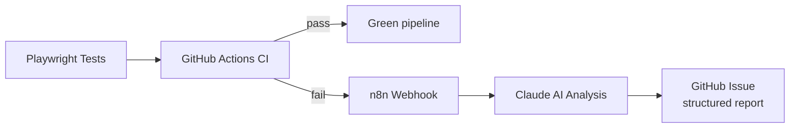
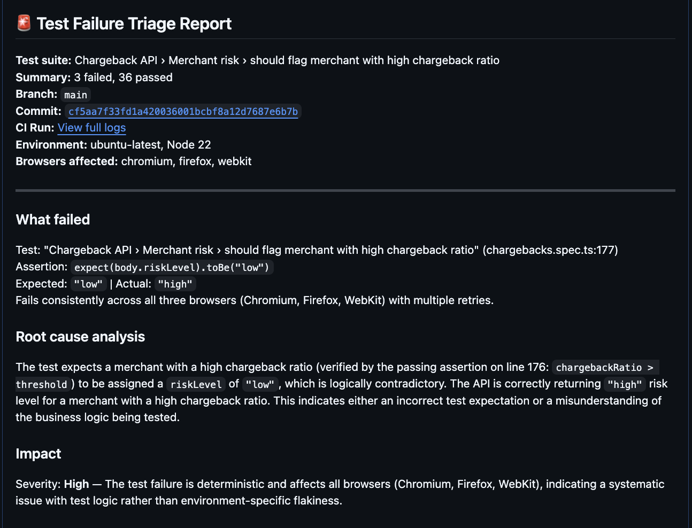
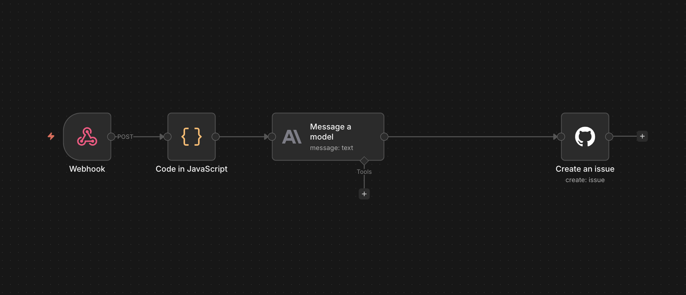

# Chargeback QA Suite

[](https://github.com/ptrcja/chargeback-qa-suite/actions/workflows/playwright.yml)
[](https://playwright.dev/)
[](https://www.typescriptlang.org/)
[](https://nodejs.org/)

> API test automation with AI-powered failure triage for payment chargeback systems.

---

## Why this project

Chargeback disputes cost the payments industry billions annually. Through client work for a regulatory tech company that serves merchants of large banks and fintech customers, I've been producing compliance training content focused on chargebacks, dispute workflows, and audit obligations. That work taught me something specific: errors in these processes aren't just bugs. They're business and sometimes legal risks.

So I decided to build a QA framework specifically around these workflows. The suite simulates a real chargeback API and exercises it across retrieval, validation, evidence submission, and risk monitoring scenarios. When tests fail in the continuous integration pipeline, an AI triage agent analyzes the failure and creates a structured GitHub Issue automatically, with no manual log reading required.

## Architecture



Every push to `main` runs **13 tests across 3 browsers (39 total executions)**. On success, the pipeline goes green. On failure, the triage agent kicks in: it cleans the test output, sends it to Claude, and posts a structured bug report as a GitHub Issue with labels `automated` and `triage`.

## AI triage report



Each report includes the failed test name, branch, commit link, CI run link, environment, browser context, an AI analysis (what failed, root cause, impact, suggested action), and the raw test output collapsed below.

**[See the live example →](https://github.com/ptrcja/chargeback-qa-suite/issues/12)**

## How the triage agent works



The pipeline POSTs failure context to an n8n webhook. From there:

1. **Code (JavaScript)** extracts test name, browser, summary, and cleans the raw output
2. **Anthropic (Claude Haiku)** analyzes the failure: what failed, root cause, impact, suggested action
3. **GitHub (Create Issue)** posts a structured report with labels `automated` and `triage`

The whole pipeline runs in seconds. The team gets a triaged issue, not a wall of logs.

## Test coverage

13 tests organized into three feature groups, run across Chromium, Firefox, and WebKit.

### Retrieval (3 tests)
- Returns a single chargeback with the correct response shape
- Returns a list of chargebacks for a payment
- Returns 404 for a non-existent chargeback

### Evidence submission (7 tests)
- Successfully submits valid evidence (201 with full body shape)
- Rejects empty body (400)
- Rejects missing tracking number (400)
- Rejects too-short tracking number (400)
- Rejects invalid email format (400)
- Rejects oversized payload over 1 MB (413)
- Rejects submission past `respondBefore` deadline (422, business rule)

### Merchant risk (3 tests)
- Flags merchant exceeding the chargeback ratio threshold
- Rejects malformed merchant ID (400)
- Returns 404 for a non-existent merchant

## Tech stack

| Tool | Role |
|------|------|
| Playwright + TypeScript | API test framework |
| Mockoon | Mock API server simulating a payment provider |
| GitHub Actions | CI/CD pipeline |
| n8n | Workflow automation |
| Claude (Haiku) | Failure analysis |
| GitHub Issues | Auto-generated bug reports |

## Quick start

```bash
git clone https://github.com/ptrcja/chargeback-qa-suite.git
cd chargeback-qa-suite
npm install
npx playwright install
npm run mock &
npm test
```

## Project structure

```
chargeback-qa-suite/
├── tests/
│   └── chargebacks.spec.ts        # 13 API tests in 3 describe blocks
├── mockoon/
│   ├── server.js                  # Mock API with validation logic
│   └── chargeback-qa-suite.json   # Mockoon desktop config
├── .github/workflows/
│   └── playwright.yml             # CI + AI triage webhook trigger
├── docs/
│   ├── triage-report-example.png
│   └── n8n-workflow.png
├── playwright.config.ts
└── package.json
```

## Links

- **Live triage report example:** [Issue #12](https://github.com/ptrcja/chargeback-qa-suite/issues/12)
- **CI runs:** [GitHub Actions](https://github.com/ptrcja/chargeback-qa-suite/actions)
